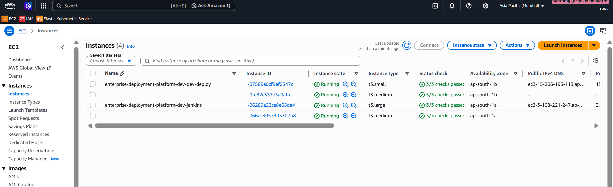
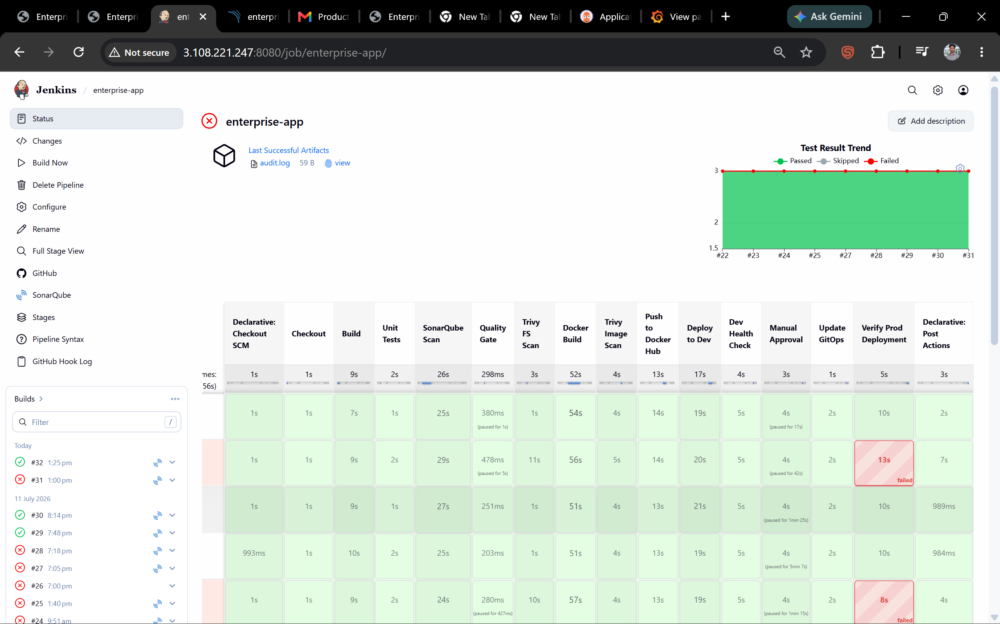
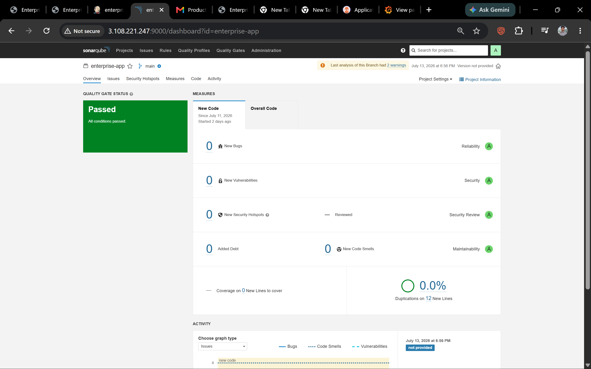
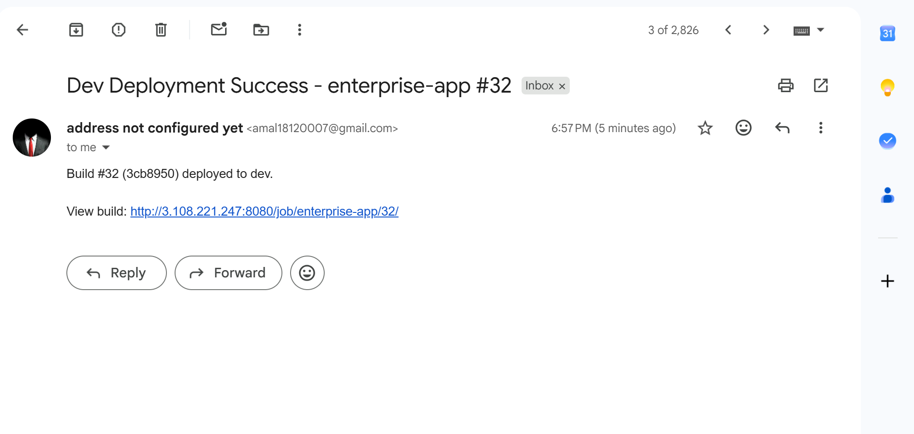
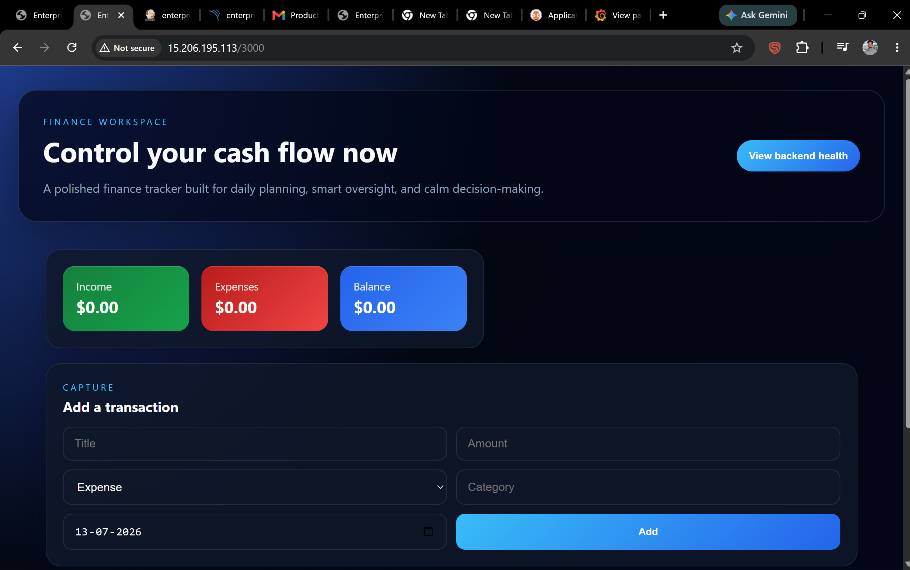
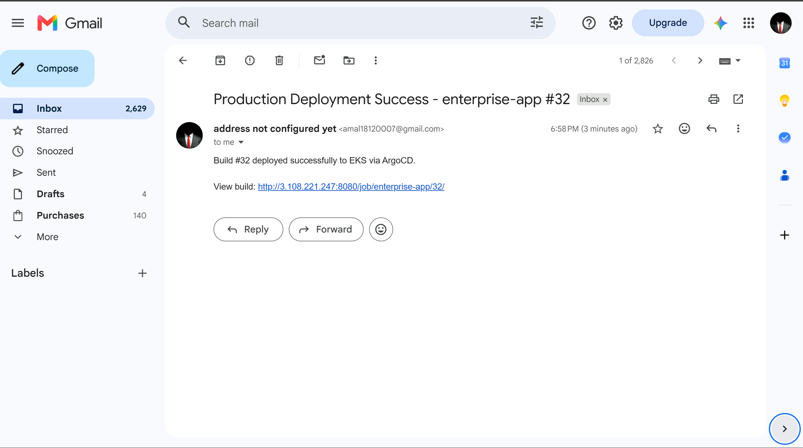
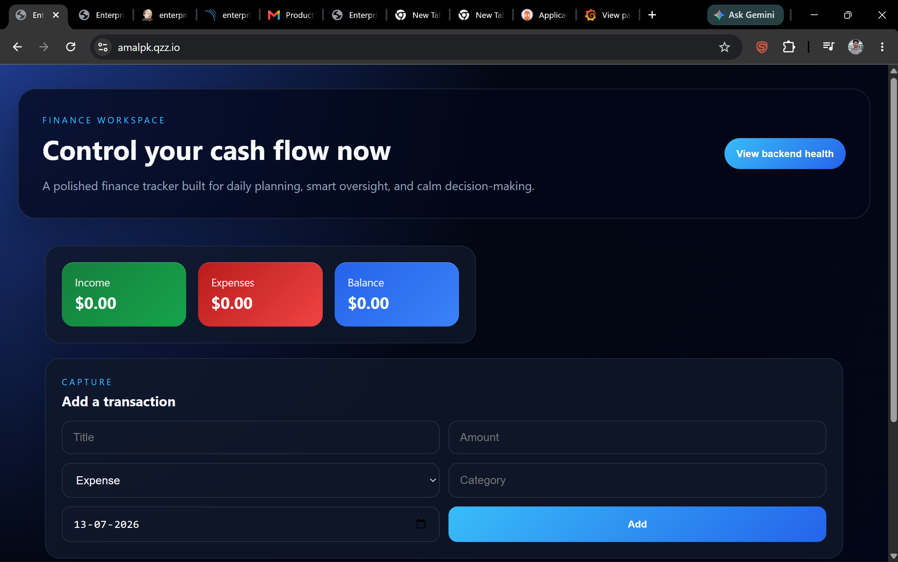
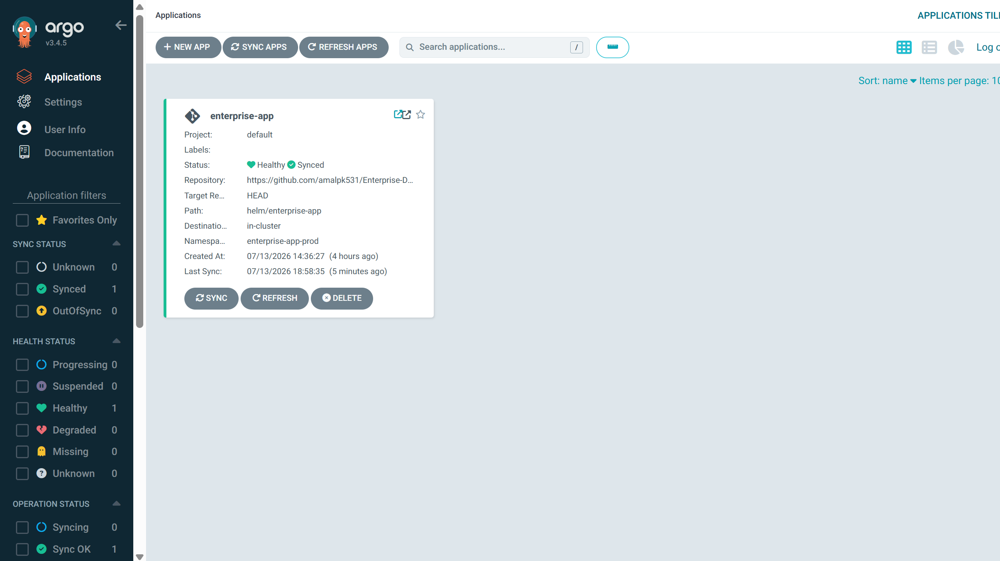
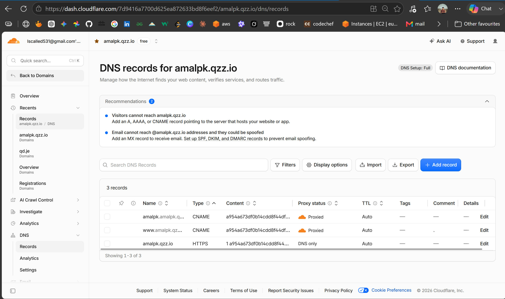
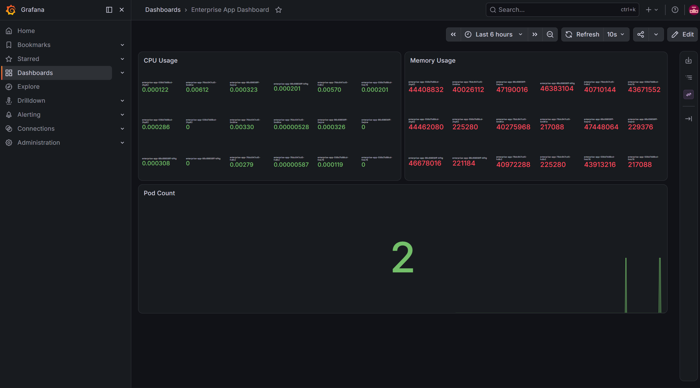

# Enterprise Deployment Platform

Production-grade, end-to-end DevOps/GitOps platform that automates the full
software delivery lifecycle of a MERN-style application — from
infrastructure provisioning to a secured, monitored production release on
Amazon EKS.

**Stack:** Terraform · Ansible · Jenkins · Docker · Amazon EKS · Helm ·
Argo CD · Prometheus · Grafana · SonarQube · Trivy


---

## Table of Contents

- [Overview](#overview)
- [Architecture](#architecture)
- [Repository Structure](#repository-structure)
- [Tech Stack](#tech-stack)
- [Build Phases](#build-phases)
- [CI/CD Pipeline](#cicd-pipeline)
- [Setup Screenshots](#setup-screenshots)
- [Getting Started](#getting-started)
- [Secrets & Configuration](#secrets--configuration)
- [Roadmap](#roadmap)
- [Related Repository](#related-repository)

---

## Overview

This project provisions and operates a complete enterprise-style deployment
pipeline for a MERN application. Infrastructure, application builds,
security scanning, and production releases are automated end-to-end with
minimal manual intervention, using Infrastructure as Code, CI, CD,
Kubernetes orchestration, and cloud-native deployment on AWS.

## Architecture

```
Developer → GitHub → Jenkins → Docker Hub → GitOps Repo → Argo CD →
Amazon EKS → NGINX Ingress → AWS Load Balancer → End Users
```

**Secrets flow:**

```
AWS Secrets Manager → External Secrets Operator → Kubernetes Secret →
Application Pods → MongoDB Atlas
```

## Repository Structure

```
Enterprise-Deployment-Platform/
├── ansible/                # Configuration management (Jenkins, SonarQube, Docker)
│   ├── inventory/
│   ├── playbook.yml
│   └── roles/
│       ├── docker/
│       ├── jenkins/
│       └── sonarqube/
├── app/                     # Application source
│   ├── backend/
│   ├── frontend/
│   ├── docker-compose/
│   ├── docker-compose.local.yml
│   ├── Dockerfile
│   └── nginx/
├── terraform/                # AWS infrastructure as code
│   ├── bootstrap/             # Remote state backend (S3)
│   ├── modules/
│   │   ├── vpc/
│   │   ├── security-group/
│   │   ├── iam/
│   │   ├── eks/
│   │   └── ec2/
│   └── environments/
│       ├── dev/
│       └── prod/
├── setup-screenshot/         # Screenshots documenting the working setup
├── Jenkinsfile                # CI/CD pipeline definition
└── readme.md
```

## Tech Stack

| Layer | Tools |
|---|---|
| Application | Node.js/Next.js frontend & backend, MongoDB / MongoDB Atlas |
| Containerization | Docker, Docker Compose |
| Infrastructure as Code | Terraform (VPC, subnets, NAT/IGW, security groups, IAM, EKS) |
| Configuration Management | Ansible (Jenkins & SonarQube provisioning) |
| CI/CD | Jenkins (declarative pipeline) |
| Code Quality & Security | SonarQube (quality gate), Trivy (filesystem & image scanning) |
| Orchestration | Amazon EKS (Kubernetes), Helm charts |
| GitOps / CD | Argo CD, dedicated GitOps repository |
| Monitoring | Prometheus, Grafana |
| Secrets | AWS Secrets Manager + External Secrets Operator |

## Build Phases

1. **Application Development** — MERN app running via Docker Compose (app + MongoDB container), with persisted data via a named Docker volume. Dev connection string: `mongodb://mongo:27017/enterprise_app`.
2. **Containerization** — Production Dockerfiles, immutable versioned images pushed to Docker Hub via Jenkins (e.g. `amalpk531/enterprise-app:25`).
3. **Infrastructure Provisioning** — Terraform builds the VPC, public/private subnets, IGW, NAT gateway, route tables, security groups, IAM roles, and an Amazon EKS cluster with managed node groups.
4. **Configuration Management** — Ansible configures the Jenkins and SonarQube servers.
5. **CI/CD Pipeline** — Jenkins pipeline: checkout → install deps → unit tests → SonarQube scan → quality gate → Trivy filesystem scan → Docker build → Trivy image scan → Docker push → update GitOps repo.
6. **DevSecOps** — SonarQube and Trivy integrated directly into the pipeline as quality/security gates.
7. **GitOps** — A separate [GitOps repository](https://github.com/amalpk531/Enterprise-Deployment-Platform-gitops) holds Helm charts, Kubernetes manifests, Argo CD app configs, and monitoring resources. Jenkins updates the image tag in `values-prod.yaml` and pushes to this repo; Argo CD detects the change and syncs the cluster automatically.
8. **Kubernetes Deployment** — App packaged with Helm and deployed to EKS via Argo CD (Namespace, Deployment, Service, ConfigMap, Secret, ServiceAccount, Ingress).
9. **Database Architecture** — Dev uses MongoDB via Docker Compose; production uses MongoDB Atlas (`mongodb+srv://<atlas-connection-string>`) instead of self-hosting MongoDB on the cluster.
10. **Secret Management** — Production secrets flow from AWS Secrets Manager through the External Secrets Operator into Kubernetes Secrets, consumed by the app via `process.env.MONGO_URI`.
11. **Monitoring** — Prometheus, Grafana, and Alertmanager for observability.

## CI/CD Pipeline

The Jenkins pipeline (see [`Jenkinsfile`](./Jenkinsfile)) runs the following stages:

1. Checkout
2. Build (backend + frontend, `npm ci`)
3. Unit Tests (with JUnit results published)
4. SonarQube Scan
5. Quality Gate (aborts pipeline on failure)
6. Trivy Filesystem Scan (`HIGH,CRITICAL`, fails build on findings)
7. Docker Build
8. Trivy Image Scan (`HIGH,CRITICAL`)
9. Push to Docker Hub (tagged with build number + `latest`)
10. Deploy to Dev (via SSH + Docker Compose, with retries)
11. Dev Health Check (polls `/api/health`)
12. Manual Approval gate (30-minute timeout, emailed for approval)
13. Update GitOps repo (bumps `values-prod.yaml` image tag, commits, pushes — triggering Argo CD sync)

Build/deploy notifications are emailed on both dev deploy success/failure and when a build is awaiting production approval.

## Setup Screenshots

The [`setup-screenshot/`](./setup-screenshot) folder contains screenshots captured while standing up and validating the platform.

**Infrastructure & remote state**


*Terraform remote state backend — S3 bucket for state storage/locking.*


*Provisioned EC2 instances (Jenkins/SonarQube hosts).*


*Tearing down infrastructure cleanly via `terraform destroy`.*

**CI/CD & code quality**


*Jenkins declarative pipeline running through all stages.*


*SonarQube code quality analysis and quality gate.*

**Deployments**


*Successful automated deployment to the dev environment.*


*The application running in the dev environment.*


*Email notification confirming a successful production deployment.*


*Email notification for the manual production-approval gate.*


*The application running in production on Amazon EKS.*

**GitOps & Kubernetes**


*The GitOps repository holding Helm charts and Argo CD app definitions.*


*Argo CD syncing the application into the EKS cluster.*

**Networking & Monitoring**


*DNS configuration in Cloudflare pointing to the AWS load balancer.*


*Grafana dashboard for cluster/application monitoring.*

## Getting Started

> These are the general steps to stand this platform up in your own AWS account. Adjust variables, hostnames, and credentials to match your environment.

**Prerequisites**

- AWS account with sufficient IAM permissions
- Terraform, Ansible, `kubectl`, and Helm installed locally
- Docker Hub account
- GitHub account (with a separate GitOps repo, e.g. a fork of [`Enterprise-Deployment-Platform-gitops`](https://github.com/amalpk531/Enterprise-Deployment-Platform-gitops))
- MongoDB Atlas cluster for production

**1. Local application development**

```bash
cd app
docker compose -f docker-compose.local.yml up -d
```

**2. Bootstrap Terraform remote state**

```bash
cd terraform/bootstrap
terraform init
terraform apply
```

**3. Provision AWS infrastructure**

```bash
cd terraform/environments/dev   # or prod
terraform init
terraform plan
terraform apply
```

This creates the VPC, subnets, NAT/IGW, security groups, IAM roles, and the EKS cluster with managed node groups.

**4. Configure Jenkins & SonarQube with Ansible**

```bash
cd ansible
ansible-playbook -i inventory/hosts playbook.yml
```

**5. Configure the Jenkins pipeline**

- Point Jenkins at this repository and create a pipeline job using the root [`Jenkinsfile`](./Jenkinsfile).
- Add the required Jenkins credentials: `dockerhub-token`, `github-token`, `dev-deploy-ssh-key`, plus SonarQube server config.
- Set required environment values: `DOCKERHUB_USERNAME`, `DEV_DEPLOY_HOST`.

**6. Deploy via GitOps**

- Install Argo CD on the EKS cluster and point it at the GitOps repository's Helm chart.
- Merge/push a change to `app` — Jenkins builds, scans, pushes the image, and updates `values-prod.yaml` in the GitOps repo; Argo CD syncs the cluster automatically.

**7. Monitoring**

- Deploy Prometheus and Grafana (e.g. via the `kube-prometheus-stack` Helm chart) into the cluster for metrics and dashboards.

## Secrets & Configuration

- **Application:** reads its Mongo connection string from `process.env.MONGO_URI`.
  - Dev: `mongodb://mongo:27017/enterprise_app`
  - Prod: `mongodb+srv://<atlas-connection-string>`
- **Production secrets** are stored in AWS Secrets Manager and synced into the cluster as native Kubernetes Secrets by the External Secrets Operator — application code and manifests never hold raw credentials.

## Roadmap

- [ ] Finish wiring Prometheus/Grafana/Alertmanager dashboards and alert rules
- [ ] Expand automated test coverage in the CI pipeline
- [ ] Add autoscaling policies (HPA/Cluster Autoscaler) for the EKS node groups

## Related Repository

- GitOps repository (Helm charts, Kubernetes manifests, Argo CD app configs): [`Enterprise-Deployment-Platform-gitops`](https://github.com/amalpk531/Enterprise-Deployment-Platform-gitops)

---

*This README was generated from the repository contents and the screenshots in `setup-screenshot/`.*
